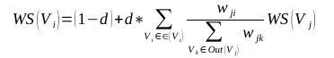

# 关键词提取各算法详解

## 1. tfidf

目前，真正在搜索引擎等实际应用中广泛使用的是 tf-idf 模型。tf-idf 模型的主要思想是：如果词w在一篇文档d中出现的频率高，并且在其他文档中很少出现，则认为词w具有很好的区分能力，适合用来把文章d和其他文章区分开来。该模型主要包含了两个因素：<br>
1) 词w在文档d中的词频 tf (Term Frequency)，即词w在文档d中出现次数 count (w， d)和w在文档集合D中出现总次数 count (w， D)的比值：
```python
tf (w,d)
= count (w, d) / count (w, D)
= count (w, d) / sum { i = 1..n | count (w, d[i]) }
```
2) 词w在整个文档集合中的逆向文档频率 idf (Inverse Document Frequency)，即文档总数n与词w所出现文件数 docs (w， D)比值的对数:
```python
idf = log (n / docs (w, D))
```
3) tfidf = tf * idf
```
改进方案：改写tfidf加入词性和专业词权重
```
http://blog.csdn.net/sangyongjia/article/details/52440063

## 2. topic-model(LDA)

实际上LDA主题模型是一种对文本进行无监督聚类的方法，每一个主题实际上对应的就是一个类（注意理解这句话），而当每个文档被解释成基于各个主题的一个分布的向量时，其在各个主题上的概率（载荷）对应的是对各个类别进行“软分类”的隶属度。
```
LDA学习过程
LDA算法开始时，先随机地给θd和φt赋值，对所有的d和t（θd,φt表示第d个文档下的Topic分布和第t个Topic下词的分布，前者是t维(t为Topic总数）向量，后者是v维向量（v为词典中term总数））。然后上述过程不断重复，最终收敛到的结果就是LDA的输出。再详细说一下这个迭代的学习过程：
1）针对一个特定的文档ds中的第i单词wi，如果令该单词对应的topic为tj，可以把上述公式改写为：
pj(wi|ds) = p(wi|tj)*p(tj|ds)
先不管这个值怎么计算（可以先理解成直接从θds和φtj中取对应的项。实际没这么简单，但对理解整个LDA流程没什么影响，后文再说）。
2）现在我们可以枚举T中的topic，得到所有的pj(wi|ds)，其中j取值1~k。然后可以根据这些概率值结果为ds中的第i个单词wi选择一个topic。最简单的想法是取令pj(wi|ds)最大的tj（注意，这个式子里只有j是变量），即
argmax[j]pj(wi|ds)
当然这只是一种方法（好像还不怎么常用），实际上这里怎么选择t在学术界有很多方法，我还没有好好去研究。
3）然后，如果ds中的第i个单词wi在这里选择了一个与原先不同的topic，就会对θd和φt有影响了（根据前面提到过的这两个向量的计算公式可以很容易知道）。它们的影响又会反过来影响对上面提到的p(w|d)的计算。对D中所有的d中的所有w进行一次p(w|d)的计算并重新选择topic看作一次迭代。这样进行n次循环迭代之后，就会收敛到LDA所需要的结果了。
```

LDA整体流程：<br>
http://blog.sina.com.cn/s/blog_8eee7fb60101czhx.html<br>
https://blog.csdn.net/nanjunxiao/article/details/9006539<br>

## 3. textrank关键词提取
TextRank 算法是一种用于文本的基于图的排序算法。其基本思想来源于谷歌的 PageRank算法, 通过把文本分割成若干组成单元(单词、句子)并建立图模型, 利用投票机制对文本中的重要成分进行排序, 仅利用单篇文档本身的信息即可实现关键词提取、文摘。和 LDA、HMM 等模型不同, TextRank不需要事先对多篇文档进行学习训练, 因其简洁有效而得到广泛应用。

TextRank一般模型可以表示为一个有向有权图G =(V, E), 由点集合V和边集合E组成, E是V×V的子集。图中任两点Vi, Vj之间边的权重为wji, 对于一个给定的点Vi, In(Vi)为指向该点的点集合, Out(Vi)为点Vi指向的点集合。点Vi的得分定义如下:<br>
 <br>
其中, d 为阻尼系数, 取值范围为 0 到 1, 代表从图中某一特定点指向其他任意点的概率, 一般取值为 0.85。使用TextRank 算法计算图中各点的得分时, 需要给图中的点指定任意的初值, 并递归计算直到收敛, 即图中任意一点的误差率小于给定的极限值时就可以达到收敛, 一般该极限值取 0.0001。<br>
**算法步骤**<br>
1)把给定的文本T按照完整句子进行分割，即T=[S1,S2..Sm] <br>
2)对于每个句子，进行分词和词性标注处理，并过滤掉停用词，只保留指定词性的单词，如名词、动词、形容词。 <br>
3)构建候选关键词图G = (V,E)，其中V为节点集，由（2）生成的候选关键词组成，然后采用共现关系（co-occurrence）构造任两点之间的边，两个节点之间存在边仅当它们对应的词汇在长度为K的窗口中共现，K表示窗口大小，即最多共现K个单词。 <br>
4)根据上面公式，迭代传播各节点的权重，直至收敛。 <br>
5)对节点权重进行倒序排序，从而得到最重要的T个单词，作为候选关键词。 <br>
6)由5得到最重要的T个单词，在原始文本中进行标记，若形成相邻词组，则组合成多词关键词。<br>

https://www.cnblogs.com/xueyinzhe/p/7101295.html
