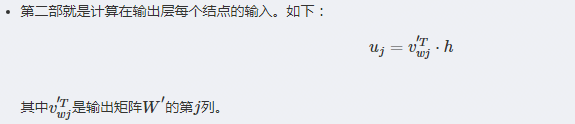

# word2vec详细笔记

word2vec也叫word embeddings，中文名“词向量” 
word2vec本质上来说就是一个矩阵分解的模型，简单地说，矩阵刻画了每个词和其上下文的词的集合的相关情况。对这个矩阵进行分解，只取每个词对应在隐含空间的向量。 
https://blog.csdn.net/mylove0414/article/details/61616617

## 1. CBOW模型

**1.1 前向传播** 

在上图中，该模型的输入输出与skip-gram模型的输入输出是相反的。这里输入层是由one-hot编码的输入上下文{x1,…,xC}组成，其中窗口大小为C，词汇表大小为V。 
比如C=2，V=10000 
x1 = \[0,0,1,0,0,0,.....] 
x2 = \[0,0,0,0,1,0,.....] 
隐藏层是N维的向量。最后输出层是也被one-hot编码的输出单词y。被one-hot编码的输入向量通过一个V×N维的权重矩阵W连接到隐藏层；隐藏层通过一个N×V的权重矩阵W′连接到输出层。

接下来，我们假设我们知道输入与输出权重矩阵的大小。

 
这里对C个x进行加总得到向量\[0,0,1,0,1,0,.....]，然后和W（V×N）进行矩阵相乘再除以C得到h，这里的h是N×1维的 
这里的h相当于把C个词向量进行加总平均操作！

 
这里得到的uj是一个数，j从1到V，一共有V个

 
最后输出V个值，从公式中可以看出是预测每个词的概率值

**1.2 通过BP（反向传播）算法及随机梯度下降来学习权重** 

在学习权重矩阵W与W′过程中，我们可以给这些权重赋一个随机值来初始化。然后按序训练样本，逐个观察输出与真实值之间的误差，并计算这些误差的梯度。
并在梯度方向纠正权重矩阵。这种方法被称为随机梯度下降。但这个衍生出来的方法叫做反向传播误差算法。  
具体推导步骤就不详写了： 

[链接地址](https://blog.csdn.net/u010665216/article/details/78724856)

## 2. Skip-gram模型

skip-gram模型和cbow模型差不多,互为镜像；明显不同的就是隐藏层，cbow是C个向量加权平均，
而skip-gram就只有一个，一个个来，如下图所示 

[链接地址](https://blog.csdn.net/u010665216/article/details/78721354)

## 3. Hierarchical Softmax 与 Negative Sampling

训练优化有Hierarchical Softmax、Negative Sampling等方式来解决。

参考网址：http://blog.csdn.net/a819825294/article/details/52438625 
参考网址2：http://www.cnblogs.com/pinard/p/7243513.html 

## 3. FastText

## 4. GolVe 
